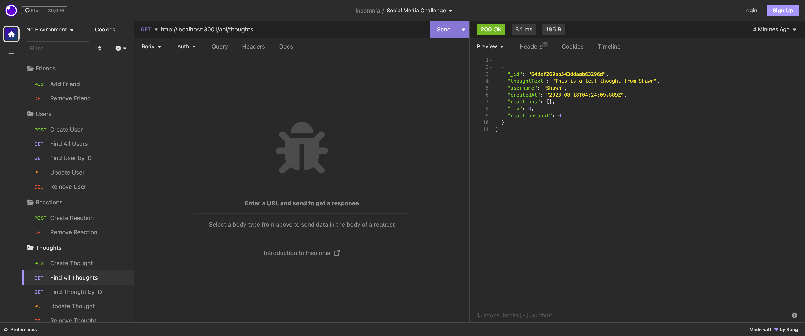

# Social Network API

## Description

This project allows the user to perform CRUD operations on typical social media data such as users, thoughts, and reactions. I got lots of great experience and exposure to the following concepts:

-Creating and storing data in a NoSQL non-relational database, particularly MongoDB 
-Using and testing multiple API routes and endpoints with the Insomnia tool 
-Dealing with the differences between models and schemas and understanding their associations 

## Installation

Since this is a node.js application it will need to be run in the terminal. Run server.js in the terminal to load up the server and database 

## Usage

The CRUD operations to perform on the datasets can be tested in Insomnia.

Click [here](https://drive.google.com/file/d/1gX4dcDrv-LVHpbATCpwR8y5KQlz7cl9v/view) to see a video walkthrough of the app in action.

## Credits

SMU Coding Bootcamp 